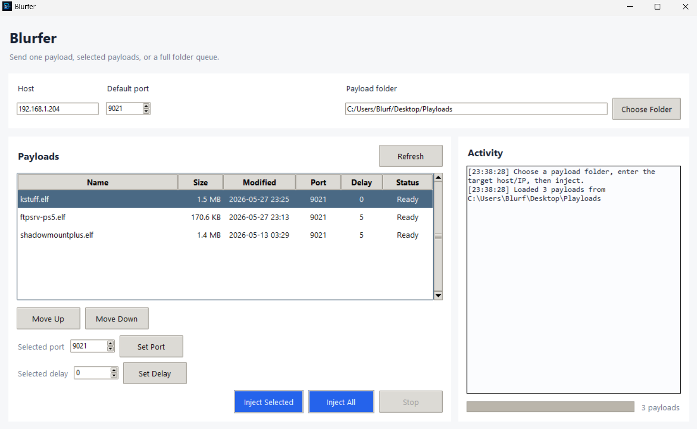
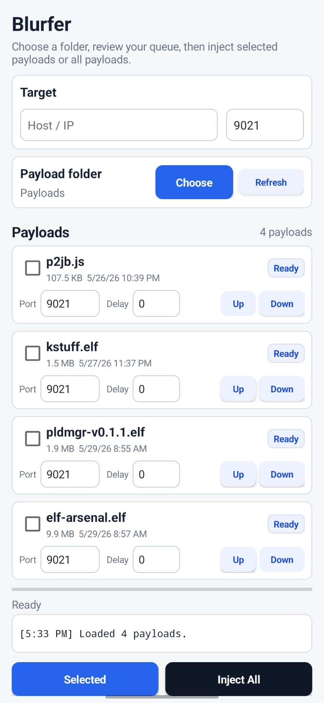

# Blurfer

Blurfer is a small cross-platform GUI for sending payload files to a target host over TCP.

macOS users can use [duperin/payload-sender](https://github.com/duperin/payload-sender/) for a macOS payload sender. Thanks to duperin for that project.

## Screenshots

### Desktop



### Android



## Usage

1. Choose the folder that contains your payload files in the app.
2. Run the GUI:

   ```powershell
   python .\blurfer.py
   ```

3. Enter the target host/IP address.
4. Keep the default port `9021`, or set the default port you use most often.
5. Use `Move Up` and `Move Down` to choose the injection order.
6. Select one or more payloads, enter a value in `Selected port`, then click `Set Port` to choose the port for each selected payload.
7. Select one or more payloads, enter a value in `Selected delay`, then click `Set Delay` to choose how long Blurfer waits before each selected payload runs.
8. Use `Inject Selected` for highlighted payloads or `Inject All` for the full folder.

Each payload row has its own port and delay in seconds. `Inject All` follows the visible order, and `Inject Selected` follows that same order for the selected payloads.
On Windows, you can drag payload files onto the Blurfer window or payload list to copy them into the selected payload folder.

The selected payload folder, host, default port, payload order, per-payload ports, and per-payload delays are saved between launches. Use `Choose Folder` to select any payload folder location.

## Build a Windows EXE

Run this on Windows:

```powershell
.\build_windows.ps1
```

The output will be:

```text
dist\Blurfer.exe
```

## Build for Linux

Run this on Linux:

```bash
chmod +x ./build_linux.sh
./build_linux.sh
```

The script builds:

```text
dist/Blurfer
```

If `appimagetool` is installed, it also builds:

```text
dist/Blurfer-x86_64.AppImage
```

For the broadest Linux compatibility, build the Linux version on an older stable distro or container. AppImage is the closest practical single-file Linux format, but no single Linux build can be guaranteed on every distro and CPU architecture.

## Android APK

The native Android app is in:

```text
android/
```

It has the same core features with a phone-friendly interface:

- choose any payload folder with Android's system folder picker
- show payload files in that folder
- reorder payloads before injection
- inject selected payloads or all payloads
- set host/IP and a default port
- set a saved port for each payload
- set a saved delay before each payload runs
- keep the activity log compact, with the full log available by tapping it
- save the selected folder and settings between launches

To build an APK from Android Studio, open the `android` folder and run:

```text
Build > Build Bundle(s) / APK(s) > Build APK(s)
```

From a terminal with Android SDK, Gradle, and Java 17 installed:

```powershell
.\build_android.ps1
```

or on Linux/macOS:

```bash
chmod +x ./build_android.sh
./build_android.sh
```

The debug APK output will be:

```text
android/app/build/outputs/apk/debug/app-debug.apk
```

The build scripts also copy it to:

```text
dist/Blurfer.apk
```
